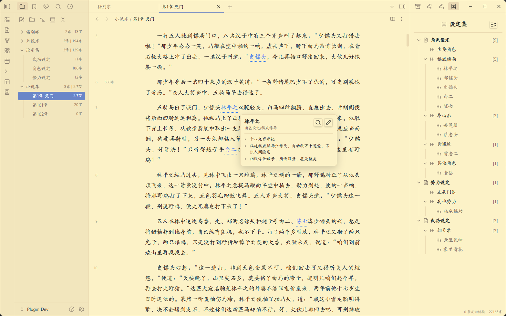
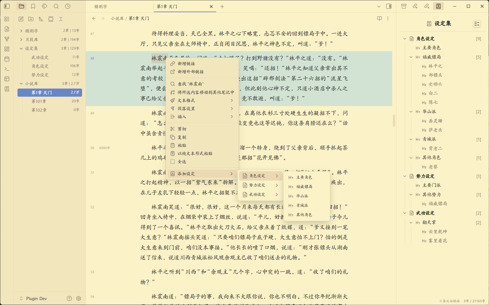
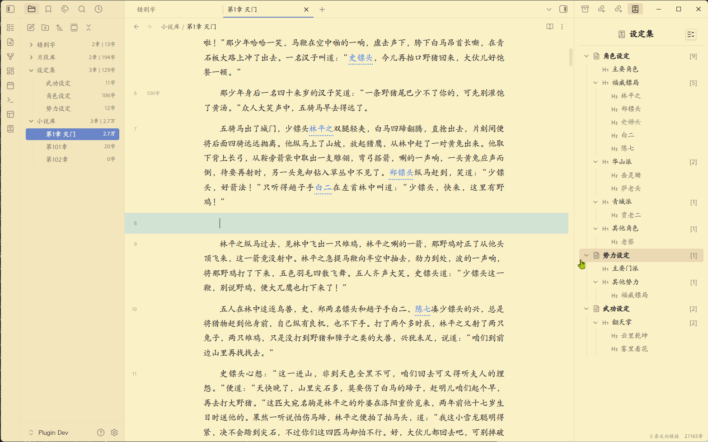
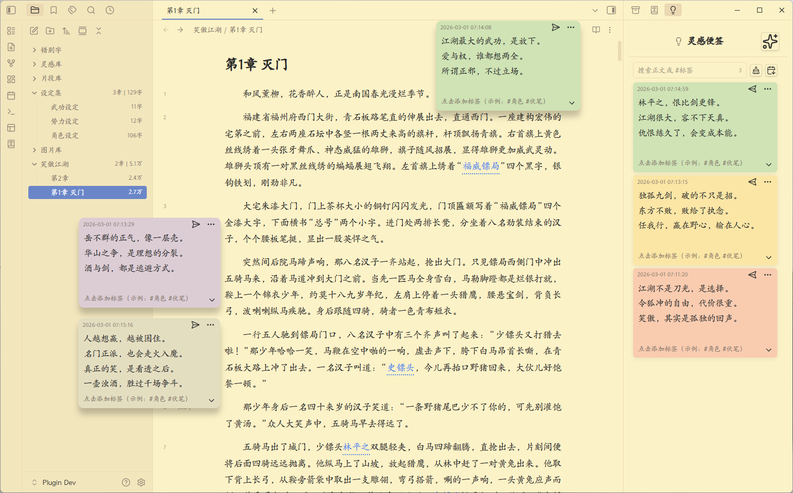
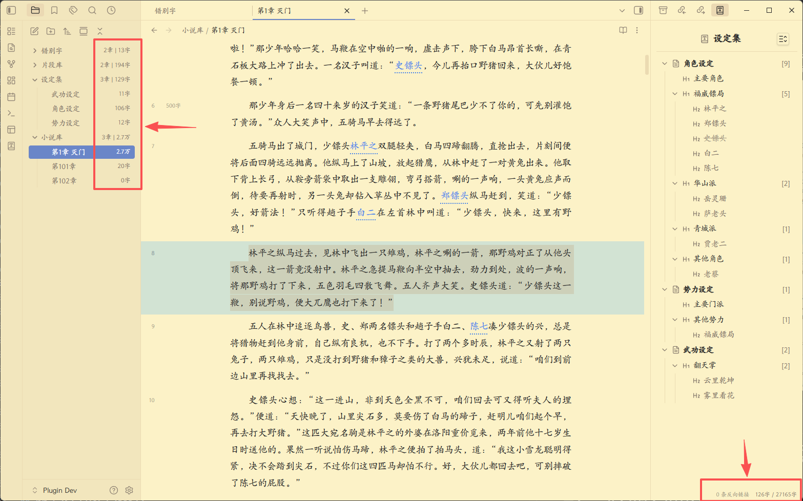
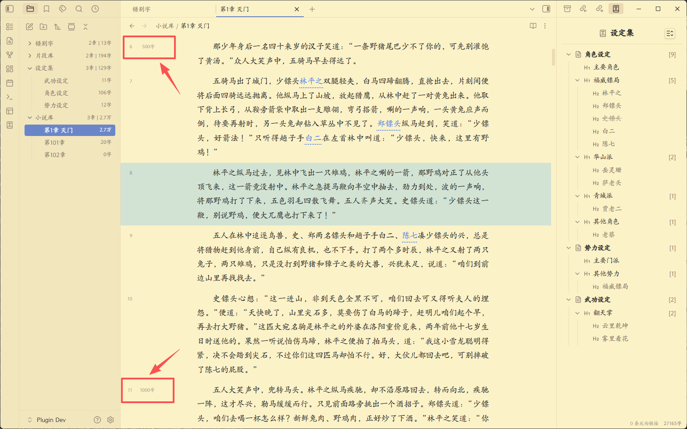
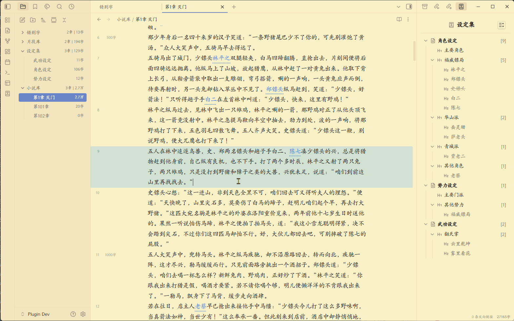
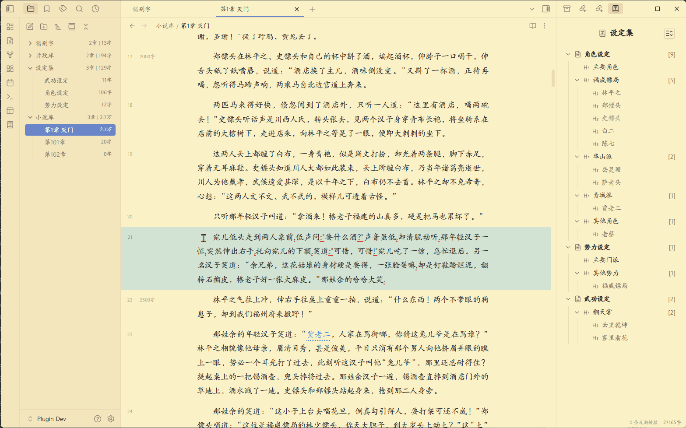
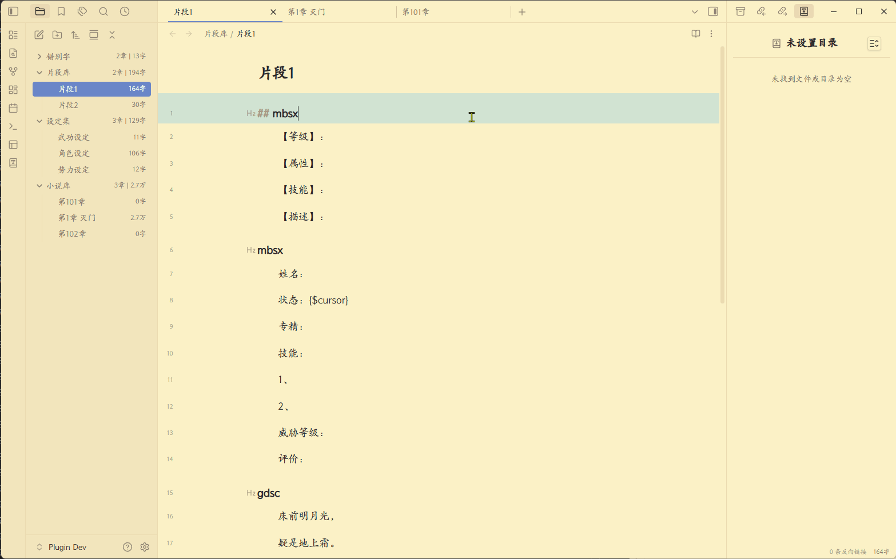
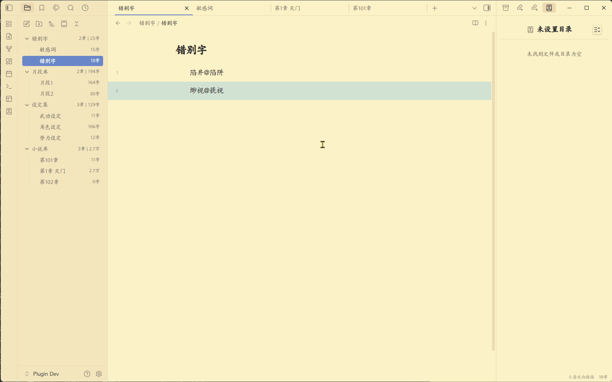

<div align="center">
	<h1>Chinese Novel Writer - 中文小说写作助手</h1>
	
	
	
	
	
</div>

<hr style="border-top: 2px dashed #ccc;">

一款辅助中文小说作者写作的 Obsidian 插件，提供一系列开箱即用的便捷功能。

<hr style="border-top: 2px dashed #ccc;">

## ✨设定库及关键字高亮功能

- 灵活、方便地**建立自己的小说设定库**，并提供右边设定视图，方便进行分类、排序和整理
- 同时提供正文内的**设定关键字高亮**，鼠标悬停高亮时，显示设定的具体内容，提供写作时的提醒
- 设定库文件本质上只是一个**本地的、普通的md文件**，也可直接打开编辑



<hr style="border-top: 2px dashed #ccc;">

## ✨右键菜单快速添加设定

- 无需离开当前页面，鼠标选中文本并点击右键菜单即可将其添加入设定库
- 添加时还可以选择现有的设定分类，对其进行预归类



<hr style="border-top: 2px dashed #ccc;">

## ✨正文中快速引用现有设定

- 在正文中输入“//+中文检索词”即可直接引用现有设定，减少前后设定不一致问题
- “中文检索词”支持**模糊搜索**，并提供类似输入法的下拉预选栏方便进行选择



<hr style="border-top: 2px dashed #ccc;">

## ✨灵感便签功能

- 提供命令快速在界面上创建悬浮的灵感便签（默认快捷键“Alt+S”），方便你记录灵感
- 提供独立的右边栏界面，方便对便签进行归档、整理和搜索
- 每个便签实际上也是独立的**md文件**，数据完全开放



<hr style="border-top: 2px dashed #ccc;">


## ✨更准确的中文字数统计

- 在按字符(character)统计字数的基础上，针对小说字数统计进行了优化
- 除右下角字数统计外，在左侧文件管理器上，也增加了同步的章节和字数统计



<hr style="border-top: 2px dashed #ccc;">

## ✨侧边栏字数里程碑（每500字）

- 在行号右侧，添加字数里程碑显示，方便了解本章写作进度



<hr style="border-top: 2px dashed #ccc;">

## ✨编辑区排版功能：行首缩进、行间距、段间距

- 提供行首缩进、行间距、段间距设定，提高阅读、写作时的浏览体验



<hr style="border-top: 2px dashed #ccc;">

## ✨常见英文标点检测与修复

- 提供中文文本中，自动检测错误英文标点的功能
- 提供手动修复英文标点错误命令，可批量手动修复检测出的英文标点

<hr style="border-top: 2px dashed #ccc;">



## ✨正文快速输入自定义文本片段

- 可自定义文本片段，并提供快速输入片段功能
- 文本片段本质上只是**本地的md文件**，可自己打开编辑

<hr style="border-top: 2px dashed #ccc;">



## ✨自定义错别字和敏感词检测与修复

- 可自定义错别字和敏感词，会在正文对其进行检测和提示
- 提供手动修改错别字和敏感词命令，可批量手动修复检测出的错别字和敏感词



<hr style="border-top: 2px dashed #ccc;">

# 使用方法

## 安装插件：方法一
1. 开启obsidian的第三方插件功能。
2. 在obsidian插件目录下，新建chinese novel writer目录。
3. 将release中发布的main.js、styles.css和manifest.json拷贝到新建的目录下。
4. 重启obsdian，随后在已安装插件中打开Chinese Novel Writer插件。

## 安装插件：方法二
1. 开启obsidian的第三方插件功能。
2. 在官方的社区插件市场中，搜索并下载**BRAT插件**并开启
3. 在BART插件的配置页面中，点击“Add beta plugin”按钮
4. 在弹出的窗口内，设置插件路径为**本github网页**，版本为**Latest Version**
5. 设置好后，点击“Add plugin”按钮，等待插件安装并启用。

## 配置插件
1. 在插件设置界面，添加一组文件夹对应关系，比如（小说库->设定库）。
2. 小说库就是写小说的文件夹，里面放小说各章节文件（md格式）。
3. 设定库就是写设定的文件夹，里面放设定文件（md格式）。
4. 在编辑区打开小说文件夹里的任意文件，开始编辑，右边栏就会自动显示相关的设定。
5. 其他功能配置详情见配置界面具体设置说明。

## 设定库内文件格式约定

设定库内文件需遵守一定的格式约定：
1. 每个独立的文件即一组设定集合，文件名即设定集名
2. 文件内的每个h1标题（# 标题）即设定分类，标题名即分类名
3. h1下的每个h2标题（## 标题）即设定，标题名即设定名
4. h2下的内容即设定的具体内容
5. 设定中包括“【别名】”字符后的内容，会被处理为该设定的别名，多个别名以“，”号隔开
6. 设定中包括“【状态】”字符后的内容，会被处理为该设定的状态，目前支持“死亡”和“失效”两种状态，这两种状态下，右边栏内的设定，会被灰化并打上删除线
7. 注意：h3及以下标题不会被解析为设定，孤立的h2也不会被解析

下面是一个例子：

```
# 主要角色

## 令狐冲
- 华山派大弟子，性格不羁爱自由，重视情义被正派视为不分正邪。

## 任盈盈
【别名】盈盈，圣姑
- 魔教教主任我行的女儿日月神教教主，任我行之女，东方不败尊其为圣姑，左道群豪奉若神明。
- ...

# 其他角色

## 林震南
- 【状态】死亡
- 威震江南的福威镖局总镖头，虽然武功低微，以高明生意手腕威震江南。他迎娶了洛阳金刀门王元霸之女为妻，即王夫人，两人育有一子林平之，林平之后来又娶了岳灵珊。


```

<hr style="border-top: 2px dashed #ccc;">

## 文本片段格式约定

如果要使用文本片段功能，需遵守以下约定：
1. 文件内的每个h2的标题名，即该文本片段的关键字（key），注意key只支持英文字符
2. 如果key后面不跟“@+字符串”，那在使用“//+key”检索到的预览栏内显示的是该文本片段的内容
3. 如果key后面跟“@+字符串”，那在使用“//+key”检索到的预览栏内显示的是“@”后的字符串内容

下面是一个例子：

```

## mbsx
【等级】：
【属性】：
【技能】：
【描述】：

## gdsc@李白：静夜思
床前明月光，
疑是地上霜。
举头望明月，
低头思故乡。

```

<hr style="border-top: 2px dashed #ccc;">

## 自定义错别字与敏感词词典格式约定

如果要使用自定义错别字与敏感词功能，需设置相应词典，词典文件（md文件）需遵守以下约定：
1. 文件内的每行是一个有错别字的词及其正确版，格式为“错别词@正确词”
2. 错别词在正文内出现时，会被标红提示
3. 如果错别词后有“@正确词”，当使用插件提供的命令批量修改错别词时，会自动将错别词替换为正确词

下面是词典例子：

```
陷井@陷阱
缈视@藐视
敏感

```

<hr style="border-top: 2px dashed #ccc;">

## 📝 命令列表

通过 `Ctrl/Cmd+P` 访问这些命令：

- **新建章节** - 在当前最大章节数字编号基础上新建章节
- **自动修正当前文档标点问题** - 自动修正当前文档的英文标点和中文标点不配对问题
- **自动修正当前文档错别字和敏感词** - 自动修正当前文档的错别字和敏感词（错别字和敏感词需自定义）

<hr style="border-top: 2px dashed #ccc;">

## 🤝 支持

如果您觉得 Chinese Novel Writer 有帮助，请考虑支持其开发：

- [⭐ 在 GitHub 上给项目加星](https://github.com/pingo8888/chinese-novel-writer)
- [🐛 报告问题或建议功能](https://github.com/pingo8888/chinese-novel-writer/issues)

<hr style="border-top: 2px dashed #ccc;">

## 📄 许可证

MIT License - 可自由使用和修改。

<hr style="border-top: 2px dashed #ccc;">

**Made with ❤️ by [pingo8888](https://github.com/pingo8888)**